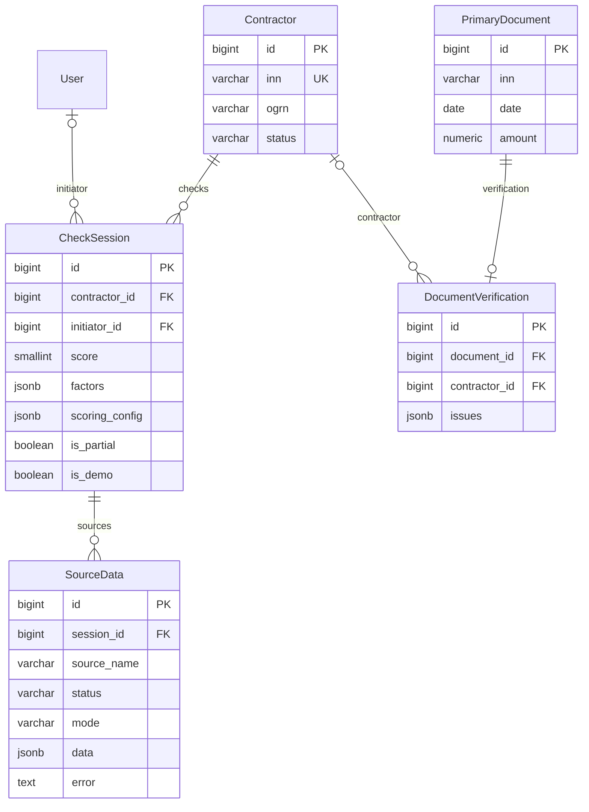

# Реляционная модель

```mermaid
erDiagram
    User o|--o{ CheckSession : initiator
    Contractor ||--o{ CheckSession : checks
    CheckSession ||--o{ SourceData : sources
    PrimaryDocument ||--o| DocumentVerification : verification
    Contractor o|--o{ DocumentVerification : contractor
    Contractor {
        bigint id PK
        varchar inn UK
        varchar ogrn
        varchar status
    }
    CheckSession {
        bigint id PK
        bigint contractor_id FK
        bigint initiator_id FK
        smallint score
        jsonb factors
        jsonb scoring_config
        boolean is_partial
        boolean is_demo
    }
    SourceData {
        bigint id PK
        bigint session_id FK
        varchar source_name
        varchar status
        varchar mode
        jsonb data
        text error
    }
    PrimaryDocument {
        bigint id PK
        varchar inn
        date date
        numeric amount
    }
    DocumentVerification {
        bigint id PK
        bigint document_id FK
        bigint contractor_id FK
        jsonb issues
    }
```

Поля и связи сверены с моделями и миграциями 0001–0005.
