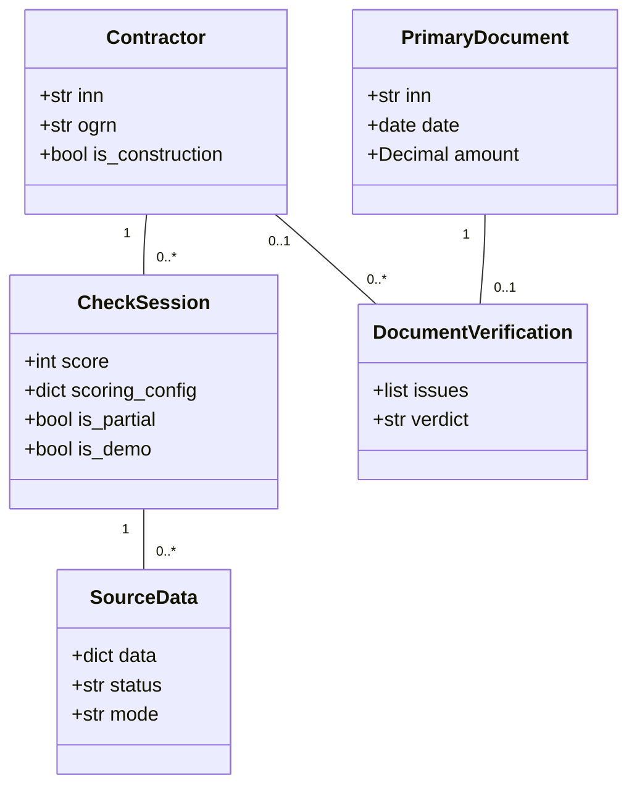

# Классы предметной области

```mermaid
classDiagram
class Contractor {
  +str inn
  +str ogrn
  +bool is_construction
}
class CheckSession {
  +int score
  +dict scoring_config
  +bool is_partial
  +bool is_demo
}
class SourceData {
  +dict data
  +str status
  +str mode
}
class PrimaryDocument {
  +str inn
  +date date
  +Decimal amount
}
class DocumentVerification {
  +list issues
  +str verdict
}
Contractor "1" -- "0..*" CheckSession
CheckSession "1" -- "0..*" SourceData
PrimaryDocument "1" -- "0..1" DocumentVerification
Contractor "0..1" -- "0..*" DocumentVerification
```
